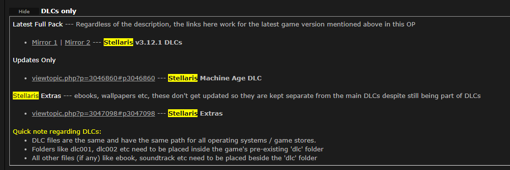

# 模拟哔咔 Android 客户端

著名粉红色 APP [https://www.picacomic.com/](https://www.picacomic.com/) 大家一定非常熟悉. 于是今天我就来研究研究他的工作原理.

首先我们下载哔咔的 Android APP, 用支持 zip 的归档管理器打开它, 取出 dex 文件准备反编译. 当然, 也可以用 apktool\([https://github.com/iBotPeaches/Apktool](https://github.com/iBotPeaches/Apktool)\) 之类的工具来解压得到 Dalvik 字节码文件.

接下去使用 dex2jar\([https://github.com/pxb1988/dex2jar](https://github.com/pxb1988/dex2jar)\) 把 dex 文件转换为 jar 文件. 现在我们有了 JVM 字节码.

很多人喜欢直接在反编译工具, 比如 jd-gui\([https://github.com/java-decompiler/jd-gui](https://github.com/java-decompiler/jd-gui)\) 里直接查看代码, 我不推荐那么做. 通常而言, 所查看的代码很有可能已经经过混淆, 在没有代码导航和 View usage 等辅助功能的情况下, 反编译代码很难阅读. 我建议在编译工具中导出源码, 然后在 IDEA 中查看.

首先新建一个 gradle 项目, 然后把 jd-gui 导出的源码 zip 包解压缩到 `src/main/java` , 项目结构就像一个标准的 Java 项目那样


由于这是一个 Android 项目, 所以还需要使用 gradle 引入运行时\(provided\)依赖来让 IDEA 提供更多代码补全, 在 `build.gradle` 中加入

```groovy
dependencies {
    // https://mvnrepository.com/artifact/com.google.android/android
    implementation group: 'com.google.android', name: 'android', version: '4.1.1.4'
}
```

现在, IDEA 可以让我们很好的阅读反编译代码了.

对于反编译项目, 快速了解它的方法是首先查看他有哪些依赖. 很显然的, 我们可以看到哔咔使用了 `Retrofit` , 那简直是再好不过了, 随便搜索一个注解


很好, 所有 API 全部都在一个文件里面 `com.picacomic.fregata.b.a` 

然后随便导航一个方法, 比如第一个方法, 发现他在这里被调用 `com.picacomic.fregata.fragments.GameDetail` 


再导航到 `dM()` 



导航至变量声明位置, 然后继续导航


现在, 我们甚至知道了客户端必须要有哪些请求头. 至于代码中那些不停在用 `StringBuilder` 构造的玩意, 应该是某种日志, 可能作者并不会用 `String.format` .

通过这里的代码, 我们可以很轻松的看出, 一个合法的哔咔客户端请求应当包含以下请求头

```text
//固定值
api-key: C69BAF41DA5ABD1FFEDC6D2FEA56B
accept: application/vnd.picacomic.com.v1+json
app-channel: 2
app-version: 2.2.1.3.3.4
app-uuid: defaultUuid
image-quality: original
app-platform: android
app-build-version: 44
User-Agent: okhttp/3.8.1
//动态的
time: 当前时间戳
nonce: 随机32长度字符串(0..9 + a..f)
signature: 用于验证请求的签名
authorization: 绝大部分 API 所需的 token
```

其中 `app-channel` 就是打开 APP 时选择的那个分流, 序号从 1 开始.

可能有人不太清楚 `app-uuid` 的值是怎么确定的, 只需要从这里开始一路导航进去


而 `app-version` 和 `app-build-version` 是通过资源文件加载的


所以我们要用 apktool 导出安装包中已被编译了的 xml 文件. 很显然, 这不是一个 i18n, 所以一定在全局的字符串资源中, 我们找到这个文件


然后直接搜索 `VERSION` 


现在, 我们知道了这几个东西的值了.

至于 `User-Agent` , 那是 `OkHttp` 自己加上去的, 我们可以在这里找到他的版本


接下去我们讲讲那几个动态的请求头.

`time` 就是当前时间戳, 这没什么好讲的.

`nonce` 是一个专有名词, 在请求中表示只使用一次的, 每次都不一样的变量, 通常是一个随机数, 用于阻止请求重放. 而在哔咔中, 他的源码是这样的

```java
String str2 = UUID.randomUUID().toString().replace("-", "");
```

众所周知 UUID 的生成是比较慢的, 而哔咔的作者为了生成一个 32 长度随机字符串, 居然想到先生成一个 UUID 然后替换掉里面的 `-` , 令人摸不到头脑.

`signature` 就是签名, 在一般的验证方案中, 这种签名就是把某些字符串全部拼起来, 然后做一个什么算法. 我们来看一下它的源码

```java
String str4 = request.url().toString().replace("https://picaapi.picacomic.com/", "");
str4 = MyApplication.bx().c(new String[] { 
    "https://picaapi.picacomic.com/", str4, str3, str2, request.method(), "C69BAF41DA5ABD1FFEDC6D2FEA56B", d.version, d.tt 
});
```

我们再来看看这个方法 `c` 是什么蛇神牛鬼


虽然有很多不知所云的代码, 但是我们已经可以猜到计算签名的第一步是构建这样的一个字符串\(源代码中构造 raw 只是为了记录日志\)

```kotlin
val time = Instant.now().epochSecond
val nonce = Random.nextString(('0'..'9') + ('a'..'f'), 32)
val path = url.substringAfter("https://picaapi.picacomic.com/")
val raw = "$path$time$nonce$method$apiKey".toLowerCase()
```

\(method 指 HttpMethod, 例如 "GET"\)

然后我们再继续往下看, 代码中调用了这几个 native method

```java
public native String getStringComFromNative();
  
public native String getStringConFromNative(String[] paramArrayOfString);
  
public native String getStringSigFromNative();
```

我们想要知道之前构建出来的字符串用什么算法以及用什么密钥来处理只能反编译安装包带有的 so 文件.


先检查一下它的 ELF header


看上去它并不需要其他第三方链接库.


